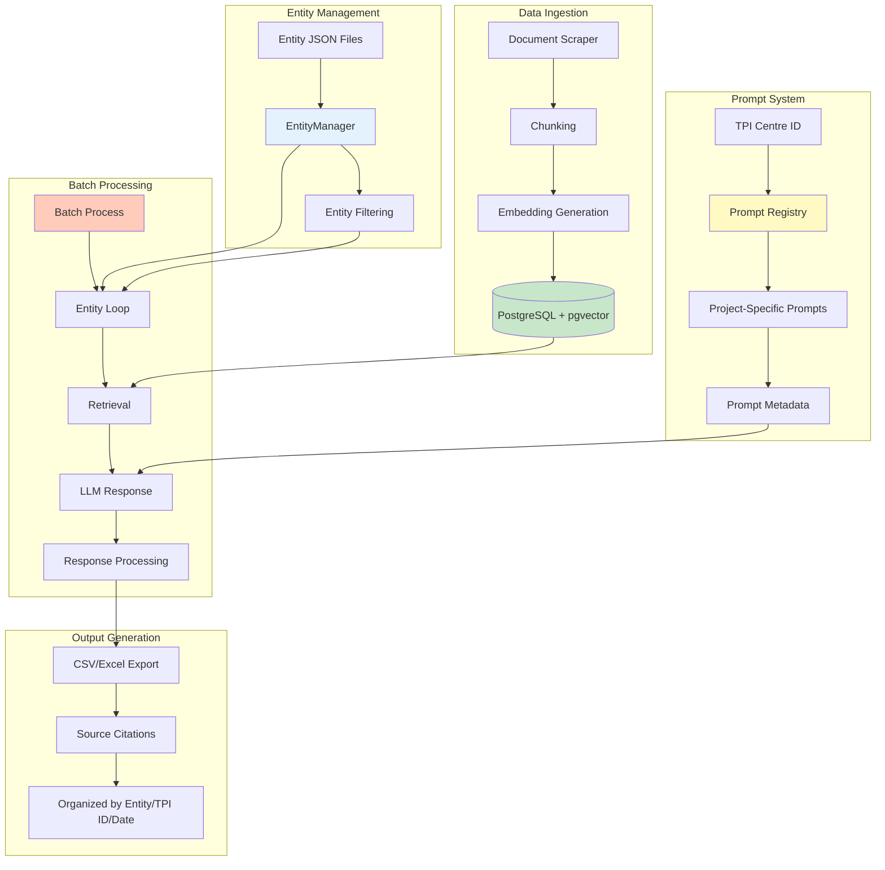
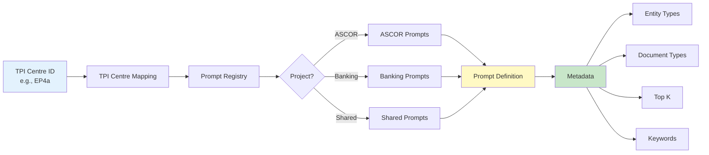
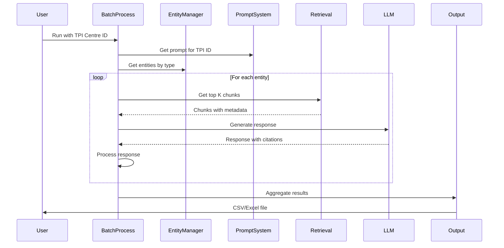
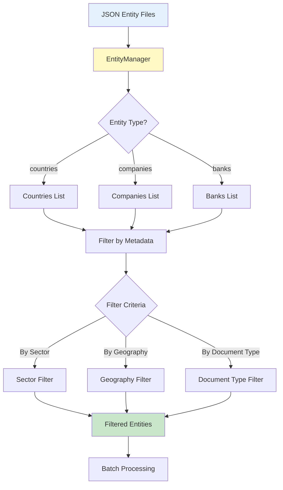

# System Architecture Diagrams

## Complete System Flow

```mermaid
graph TB
    subgraph "Data Ingestion"
        A[Document Scraper] --> B[Chunking]
        B --> C[Embedding Generation]
        C --> D[(PostgreSQL + pgvector)]
    end
    
    subgraph "Entity Management"
        E[Entity JSON Files] --> F[EntityManager]
        F --> G[Entity Filtering]
    end
    
    subgraph "Prompt System"
        H[TPI Centre ID] --> I[Prompt Registry]
        I --> J[Project-Specific Prompts]
        J --> K[Prompt Metadata]
    end
    
    subgraph "Batch Processing"
        L[Batch Process] --> M[Entity Loop]
        M --> N[Retrieval]
        N --> O[LLM Response]
        O --> P[Response Processing]
    end
    
    subgraph "Output Generation"
        P --> Q[CSV/Excel Export]
        Q --> R[Source Citations]
        R --> S[Organized by Entity/TPI ID/Date]
    end
    
    D --> N
    F --> M
    K --> O
    G --> M
    
    style D fill:#C8E6C9
    style F fill:#E3F2FD
    style I fill:#FFF9C4
    style L fill:#FFCCBC
```

## Prompt System Architecture

```mermaid
graph LR
    A[TPI Centre ID<br/>e.g., EP4a] --> B[TPI Centre Mapping]
    B --> C[Prompt Registry]
    C --> D{Project?}
    D -->|ASCOR| E[ASCOR Prompts]
    D -->|Banking| F[Banking Prompts]
    D -->|Shared| G[Shared Prompts]
    
    E --> H[Prompt Definition]
    F --> H
    G --> H
    
    H --> I[Metadata]
    I --> J[Entity Types]
    I --> K[Document Types]
    I --> L[Top K]
    I --> M[Keywords]
    
    style A fill:#E3F2FD
    style H fill:#FFF9C4
    style I fill:#C8E6C9
```

## Batch Processing Workflow

```mermaid
sequenceDiagram
    participant User
    participant BatchProcess
    participant EntityManager
    participant PromptSystem
    participant Retrieval
    participant LLM
    participant Output
    
    User->>BatchProcess: Run with TPI Centre ID
    BatchProcess->>PromptSystem: Get prompt for TPI ID
    BatchProcess->>EntityManager: Get entities by type
    loop For each entity
        BatchProcess->>Retrieval: Get top K chunks
        Retrieval-->>BatchProcess: Chunks with metadata
        BatchProcess->>LLM: Generate response
        LLM-->>BatchProcess: Response with citations
        BatchProcess->>BatchProcess: Process response
    end
    BatchProcess->>Output: Aggregate results
    Output->>User: CSV/Excel file
```

## Entity Management Flow

```mermaid
graph TD
    A[JSON Entity Files] --> B[EntityManager]
    B --> C{Entity Type?}
    C -->|countries| D[Countries List]
    C -->|companies| E[Companies List]
    C -->|banks| F[Banks List]
    
    D --> G[Filter by Metadata]
    E --> G
    F --> G
    
    G --> H{Filter Criteria}
    H -->|By Sector| I[Sector Filter]
    H -->|By Geography| J[Geography Filter]
    H -->|By Document Type| K[Document Type Filter]
    
    I --> L[Filtered Entities]
    J --> L
    K --> L
    
    L --> M[Batch Processing]
    
    style A fill:#E3F2FD
    style B fill:#FFF9C4
    style L fill:#C8E6C9
```

