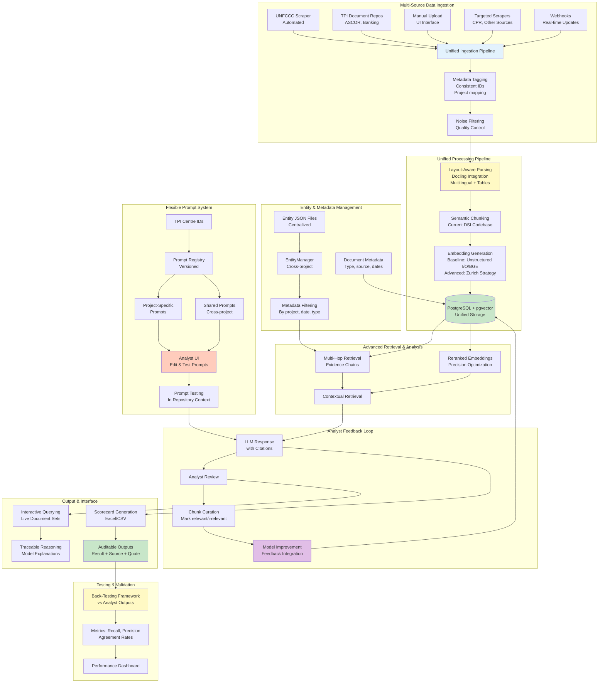
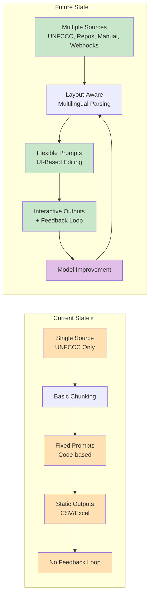
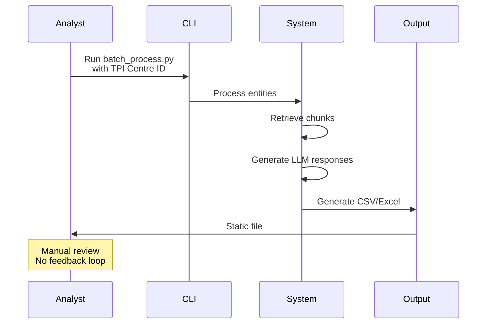
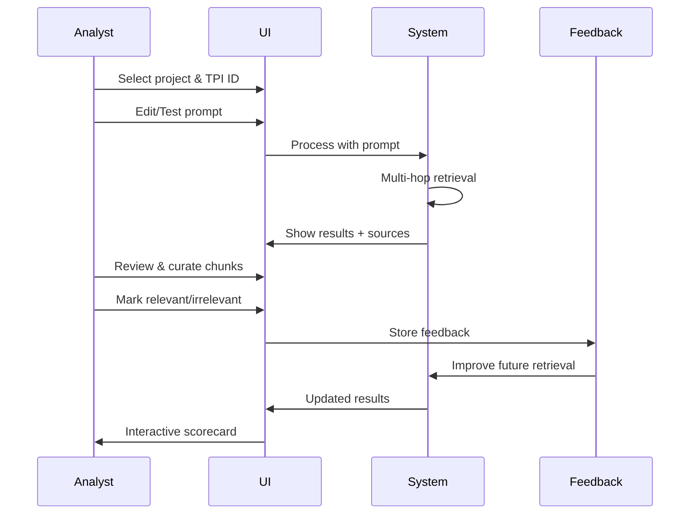
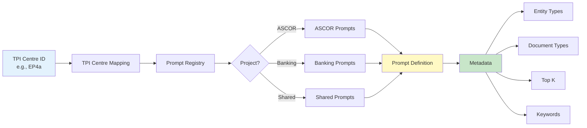
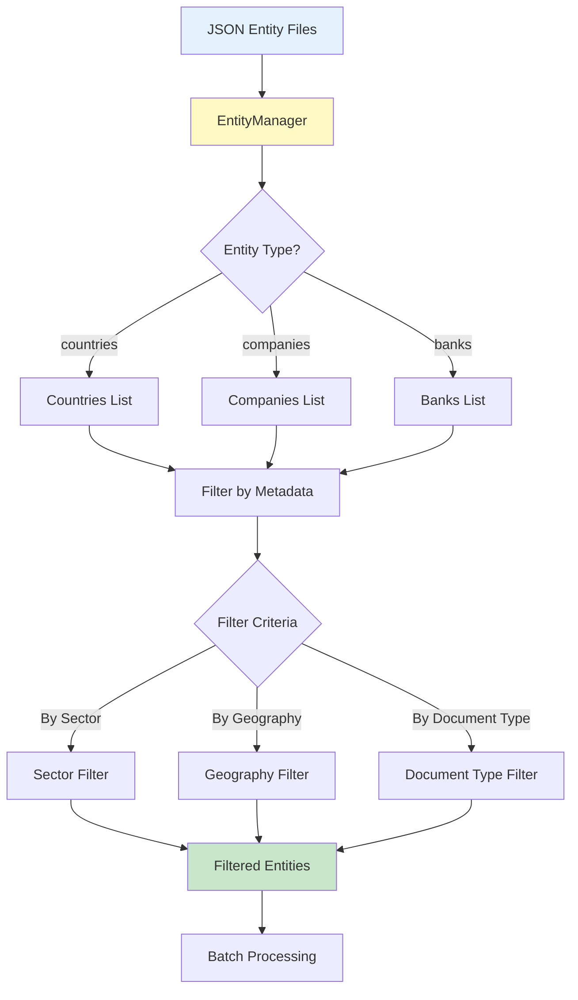
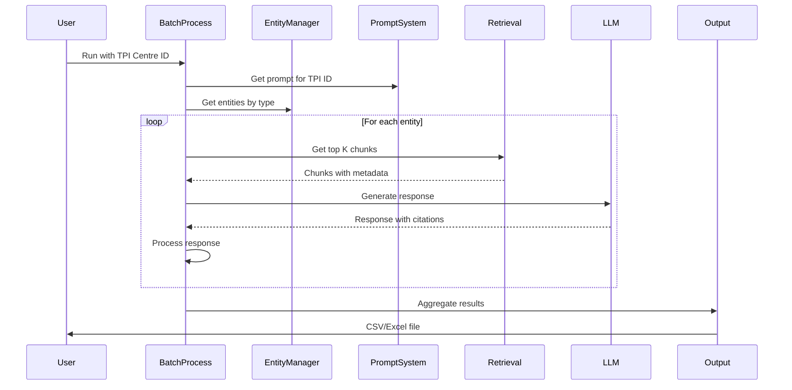

# System Architecture Diagrams

## 1. Current State: Refactored System Architecture

This diagram shows the **current implementation** with the new modular architecture we've built:

```mermaid
graph TB
    subgraph "Data Ingestion"
        A[Document Sources] --> B[Scraper<br/>UNFCCC]
        B --> C[Document Storage<br/>PostgreSQL]
        C --> D[Metadata Extraction<br/>document_type, dates, URLs]
    end
    
    subgraph "Entity Management System"
        E[Entity JSON Files<br/>countries.json<br/>companies.json<br/>banks.json] --> F[EntityManager]
        F --> G[Entity Filtering<br/>by type, sector, geography]
    end
    
    subgraph "Document Processing"
        C --> H[Chunking<br/>2_chunk.py]
        H --> I[Embedding Generation<br/>3_embed.py]
        I --> J[(PostgreSQL + pgvector<br/>Chunks + Embeddings)]
    end
    
    subgraph "Prompt System"
        K[TPI Centre ID<br/>e.g., EP4a, EP4ai] --> L[TPI Centre Mapping<br/>tpi_centres.py]
        L --> M[Prompt Registry<br/>questions/prompts/]
        M --> N{Project?}
        N -->|ASCOR| O[ASCOR Prompts<br/>projects/ascor/]
        N -->|Banking| P[Banking Prompts<br/>projects/banking/]
        N -->|Shared| Q[Shared Prompts<br/>prompts/shared/]
        O --> R[Prompt Metadata<br/>entity_types, document_types<br/>top_k, keywords]
        P --> R
        Q --> R
    end
    
    subgraph "Batch Processing"
        S[Batch Process<br/>batch_process.py] --> T[Entity Loop<br/>Filtered by type]
        T --> U[Retrieval<br/>4_retrieve.py<br/>Top K chunks]
        U --> V[LLM Response<br/>5_llm_response.py]
        V --> W[Response Processing<br/>with citations]
    end
    
    subgraph "Output Generation"
        W --> X[CSV/Excel Export<br/>6_output.py]
        X --> Y[Organized Structure<br/>outputs/csv/{entity_type}/{TPI_ID}/{date}/]
        Y --> Z[Source Citations<br/>Chunk metadata, pages, URLs]
    end
    
    G --> T
    R --> V
    J --> U
    D --> J
    
    style E fill:#E3F2FD
    style F fill:#E3F2FD
    style M fill:#FFF9C4
    style R fill:#FFF9C4
    style S fill:#FFCCBC
    style J fill:#C8E6C9
    style Y fill:#C8E6C9
```

**Key Features:**
- ✅ Centralized entity management (JSON-based)
- ✅ Project-based prompt organization
- ✅ TPI Centre ID mapping system
- ✅ Batch processing with metadata filtering
- ✅ Structured CSV/Excel outputs with citations
- ✅ No PDF/email generation (removed legacy components)

---

## 2. Future State: Ideal TPI Centre RAG System

This diagram shows the **target architecture** for MVP (January 2026) and end-state vision:



**Key Capabilities:**
- 🔄 Multi-source ingestion (UNFCCC, repos, manual, webhooks)
- 📄 Layout-aware parsing (multilingual, tables)
- 🎯 Flexible prompt editing via UI
- 🔍 Multi-hop retrieval with evidence chains
- 💬 Analyst feedback loop for continuous improvement
- 📊 Interactive querying and traceable reasoning
- ✅ Back-testing and validation framework

---

## 3. Current vs Future: Key Differences



---

## 4. Analyst Workflow Comparison

### Current Workflow (CLI-Based)


### Future Workflow (UI-Based with Feedback)


---

## 5. Detailed Component Diagrams

### Prompt System Architecture



### Entity Management Flow



### Batch Processing Workflow



---

## 6. MVP Roadmap (January 2026)

### Phase 1: Enhanced Ingestion
- ✅ Multi-source support (repos, manual upload)
- ✅ Metadata tagging system
- ✅ Noise filtering

### Phase 2: Advanced Processing
- 🔄 Layout-aware parsing (Docling)
- 🔄 Multilingual support
- 🔄 Table recognition

### Phase 3: Flexible Prompts
- 🔄 UI for prompt editing
- 🔄 Prompt testing interface
- 🔄 Version control

### Phase 4: Feedback Loop
- 🔄 Chunk curation interface
- 🔄 Model improvement integration
- 🔄 Performance tracking

---

## 7. End-State Vision (2026+)

### Advanced Features
- **Automated Source Collection**: Scalable web crawler with noise filtering
- **Enhanced Processing**: Full layout-aware, multilingual parsing
- **Contextual Retrieval**: Multi-hop and reranked embeddings
- **Analyst Feedback Loop**: Curate chunks, improve model performance
- **Interactive Workflows**: Live querying with traceable reasoning
- **Scalable Architecture**: PostgreSQL metadata, API endpoints
- **Governance & Transparency**: Versioned documentation, optional open-source

---

**Last Updated**: November 18, 2025  
**Status**: Current state implemented, future state planned for MVP (January 2026)
