# System Architecture Diagrams

## 1. Current State: Refactored System Architecture

This diagram shows the **current implementation** with the new modular architecture we've built, styled similar to LobbyMap pipeline:

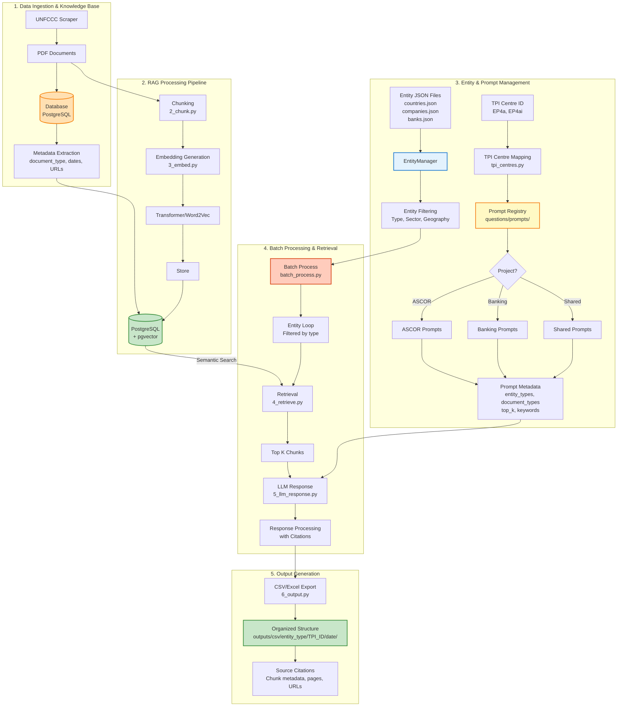

**Key Features:**
- ✅ Centralized entity management (JSON-based)
- ✅ Project-based prompt organization
- ✅ TPI Centre ID mapping system
- ✅ Batch processing with metadata filtering
- ✅ Structured CSV/Excel outputs with citations

---

## 2. Future State: Ideal TPI Centre RAG System

This diagram shows the **target architecture** for MVP (January 2026) and end-state vision, styled similar to LobbyMap pipeline:

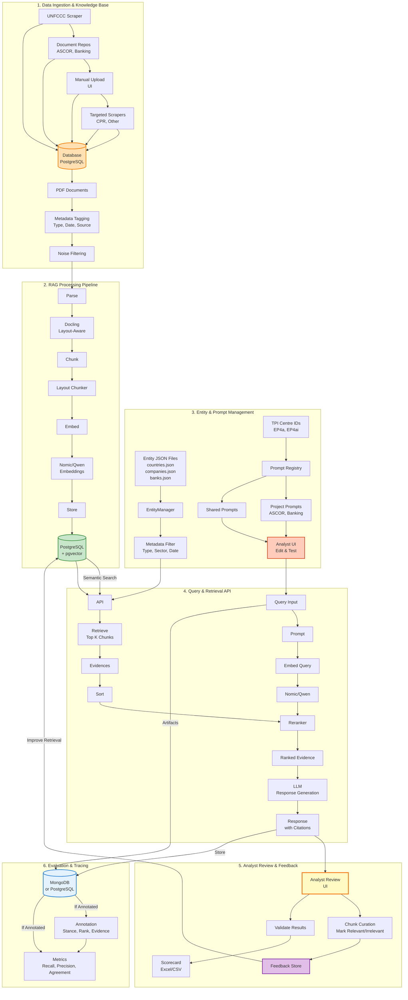

**Key Capabilities:**
- 🔄 Multi-source ingestion (UNFCCC, repos, manual, webhooks)
- 📄 Layout-aware parsing (multilingual, tables)
- 🎯 Flexible prompt editing via UI
- 🔍 Multi-hop retrieval with evidence chains
- 💬 Analyst feedback loop for continuous improvement
- 📊 Interactive querying and traceable reasoning
- ✅ Back-testing and validation framework
- 🧠 Advanced embeddings: Nomic (robust across configs) / Qwen (recall, high chunk dilution, multilingual)

---

## 3. Current vs Future: Key Differences

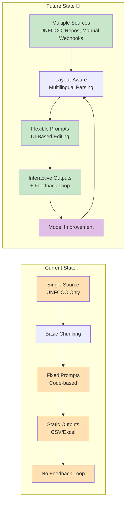

---

## 4. Analyst Workflow Comparison

### Current Workflow (CLI-Based)
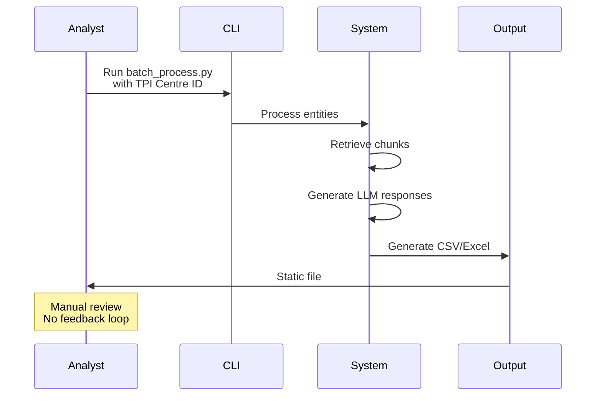

### Future Workflow (UI-Based with Feedback)
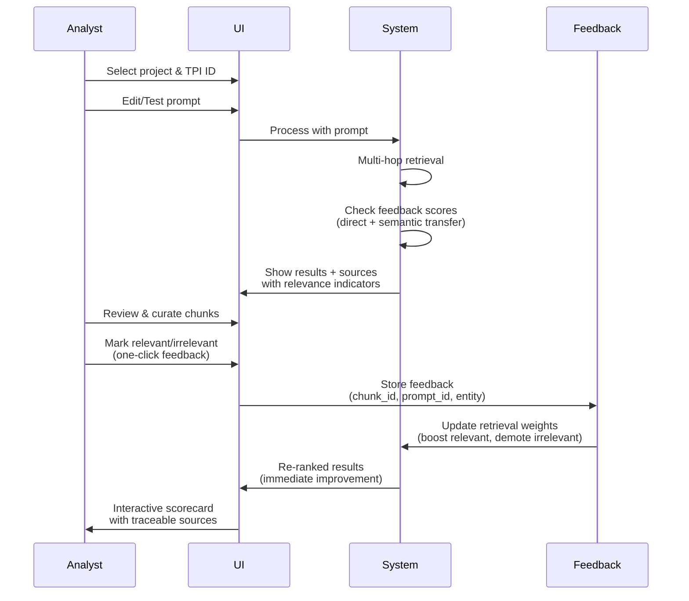

**Key Technical Details:**
- **Feedback Storage**: Simple database table with `(chunk_id, prompt_id, entity)` uniqueness constraint
- **Semantic Generalization**: Uses existing embeddings to find similar chunks and transfer feedback (see `FEEDBACK_GENERALIZATION_DESIGN.md`)
- **Re-ranking Logic**: Adjusts similarity scores by ±20% based on feedback (conservative, reversible)
- **Real-time Updates**: Feedback applied immediately to next retrieval (no model retraining required)
- **Implementation Complexity**: Low-Medium (Phase 1+2 from `FEEDBACK_LOOP_FEASIBILITY.md` = 3-6 weeks)

---

## 5. Detailed Component Diagrams

### Prompt System Architecture

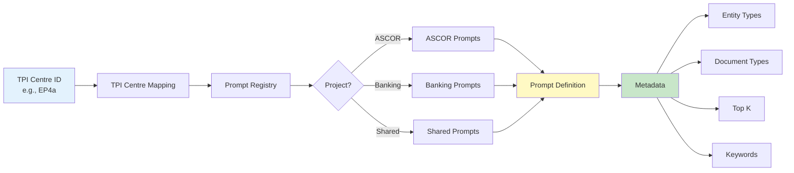

### Entity Management Flow

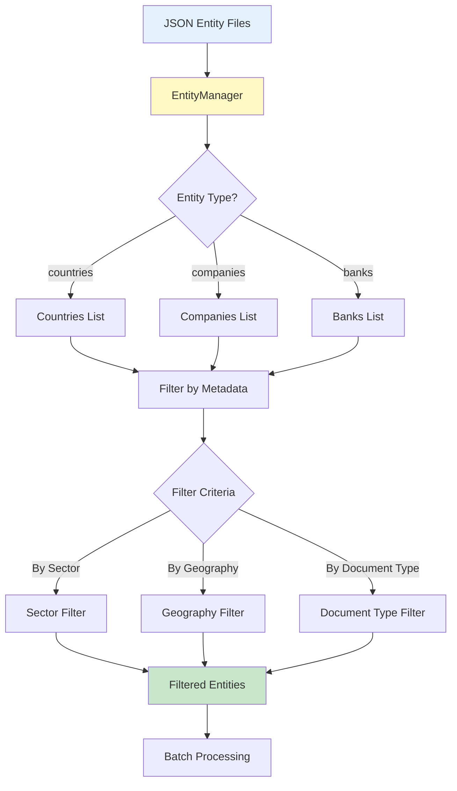

### Batch Processing Workflow

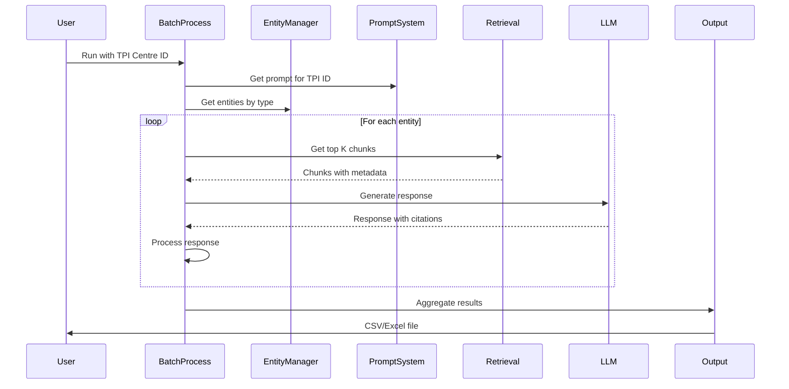

---

## 6. MVP Roadmap (January 2026)

### Phase 1: Enhanced Ingestion
- ✅ Multi-source support (repos, manual upload)
- ✅ Metadata tagging system
- ✅ Noise filtering

### Phase 2: Advanced Processing
- 🔄 Layout-aware parsing (Docling)
- 🔄 Multilingual support
- 🔄 Table recognition

### Phase 3: Flexible Prompts
- 🔄 UI for prompt editing
- 🔄 Prompt testing interface
- 🔄 Version control

### Phase 4: Feedback Loop
- 🔄 Chunk curation interface
- 🔄 Model improvement integration
- 🔄 Performance tracking

---

## 7. End-State Vision (2026+)

### Advanced Features
- **Automated Source Collection**: Scalable web crawler with noise filtering
- **Enhanced Processing**: Full layout-aware, multilingual parsing
- **Contextual Retrieval**: Multi-hop and reranked embeddings
- **Analyst Feedback Loop**: Curate chunks, improve model performance
- **Interactive Workflows**: Live querying with traceable reasoning
- **Scalable Architecture**: PostgreSQL metadata, API endpoints
- **Governance & Transparency**: Versioned documentation, optional open-source

---

---

## 8. Pitch-Ready Diagrams: Strategic Vision

### Current State: Analyst-Centered RAG System

**For project pitch documents and strategic presentations:**

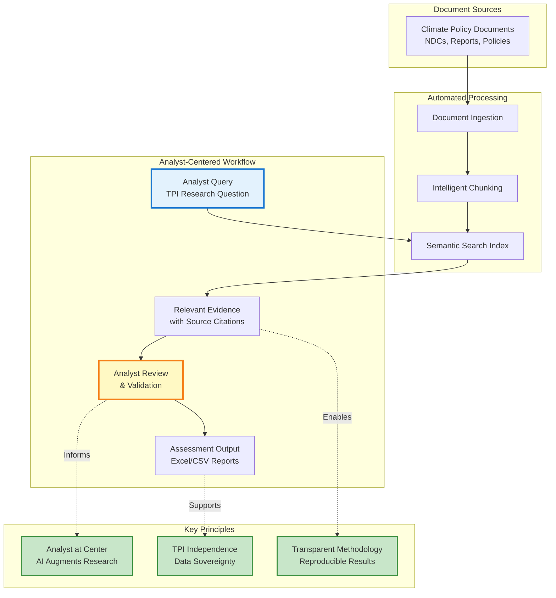

**Value Proposition:**
- ⚡ **Speed**: Rapid document-to-results pipeline
- 🎯 **Quality**: Analyst validation ensures accuracy
- 📊 **Scalability**: Process multiple entities and document types
- 🔍 **Transparency**: Full source citations for verification
- 🏛️ **Independence**: TPI-controlled infrastructure

---

### Future State: Scalable Multi-Project Platform

**For strategic vision and roadmap presentations:**

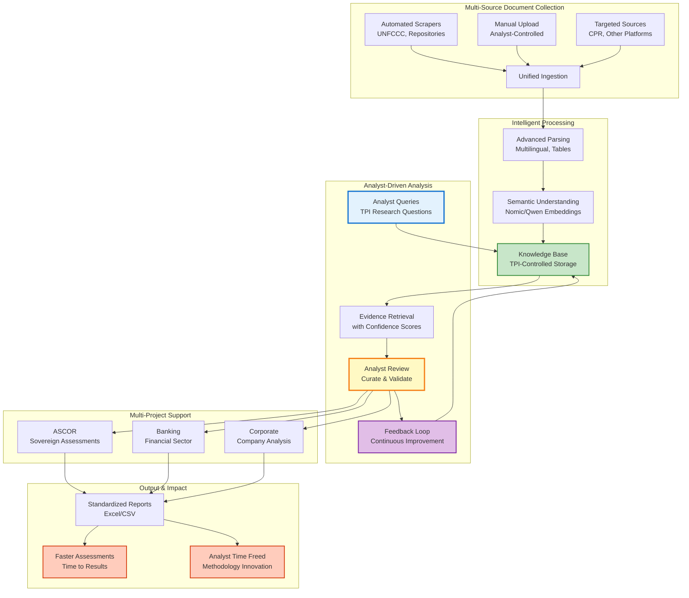

**Strategic Vision:**
- 🌍 **Multi-Entity Support**: Corporates, Banks, Sovereigns
- 🔄 **Continuous Learning**: Analyst feedback improves system
- 🎯 **Project Scalability**: Single platform, multiple TPI projects
- ⚡ **Speed & Quality**: Faster assessments, analyst-validated
- 🏛️ **TPI Sovereignty**: Independent, controlled infrastructure
- 📚 **Methodology Focus**: Frees analysts for research innovation

---

### Key Differentiators

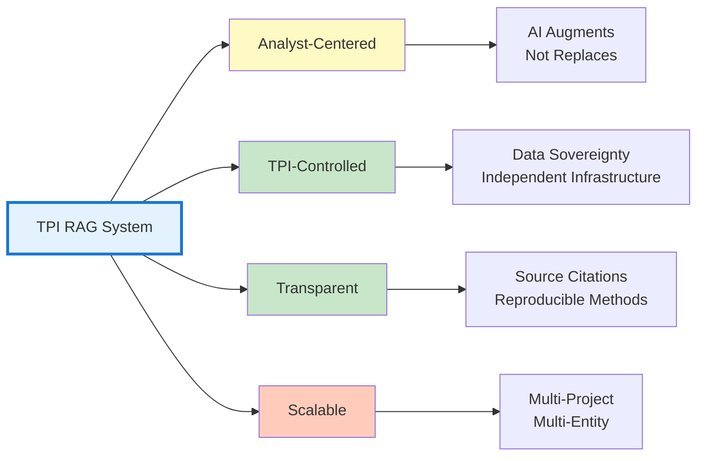

---

**Last Updated**: November 18, 2025  
**Status**: Current state implemented, future state planned for MVP (January 2026)
